# Bi-directional sync pattern Guide: A quick start template

## Overview

This manual will introduce [WANdisco](https://docs.wandisco.com/bigdata/wdfusion/adls/) as a recommended tool to set up bi-directional sync between ADLS Gen1 and Gen2 using the Replication feature.

Below will be covered as part of this guide:
  
- Data Migration from Gen1 to Gen2
- Data Consistency Check
- Application update for ADF, ADB and SQL DWH workloads

Considerations for using the bi-directional sync pattern:

- Ideal for complex scenarios that involve a large number of pipelines and dependencies where a phased approach might make more sense.
- Migration effort is high, but it provides side-by-side support for Gen1 and Gen2.
  
## Prerequisites

- **Active Azure Subscription**

- **Azure Data Lake Storage Gen1**

- **Azure Data Lake Storage Gen2** For more details please refer to :link: [create azure storage account](https://docs.microsoft.com/azure/storage/common/storage-account-create)

- **Licenses for WANdisco Fusion** that accommodate the volume of data that you want to make available to ADLS Gen2

- **Azure Linux Virtual Machine** Please refer here to know [How to create Azure VM](./wandisco-set-up-and-installation)

- **Windows SSH client** like [Putty](https://www.putty.org/), [Git for Windows](https://gitforwindows.org/), [Cygwin](https://cygwin.com/), [MobaXterm](https://mobaxterm.mobatek.net/)

## Login to Fusion UI

1. **Start** the VM in azure portal if not in Running status.

   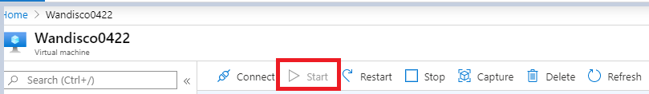

1. **Start the Fusion**

   Go to **SSH Client** [Connect](./wandisco-set-up-and-installation/#connect-to-vm) and run below commands:

   ```scala
   cd fusion-docker-compose // Change to the repository directory

   ./setup-env.sh // set up script

   docker-compose up -d // start the fusion
   ```

1. **Login to Fusion UI**. Open the web browser and give the path as below 

   URL --> http://{dnsname}:8081

   > Note: The DNS name can be taken from VM Overview details.

1. **Set up ADLS Gen1 and Gen2 storage**. [Click here](./wandisco-set-up-and-installation/#adls-gen1-and-gen2-configuration) to know more.

## Create Replication Rule

File system content is replicated selectively by defining Replication Rules.These specify the directory in the file system that will be replicated and the Zones that will participate in that replication.

Without any Replication Rules defined, each Zone’s file system operates independently of the others. With the combination of Zones and Replication Rules, WANdisco Fusion gives you complete control over how data is replicated between your file systems and/or object stores.
  
On the dashboard, create a HCFS rule with the following parameters:

- Rule Name = migration (Give any unique name)
  
- Path for all storages = /

- Default exclusions

- Preserve HCFS Block Size = False

   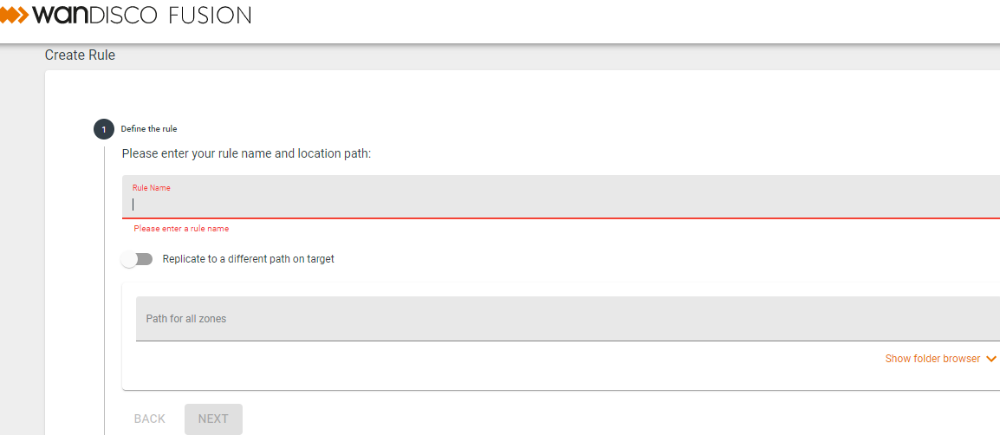

  To know more click :link: [how to create rule](https://wandisco.github.io/wandisco-documentation/docs/quickstarts/operation/create-rule)

**Click Finish** and wait for the rule to appear on the dashboard.

## Consistency Check
  
Once you have created a [replication rule](https://wandisco.github.io/wandisco-documentation/docs/quickstarts/operation/create-rule) as per above mentioned steps, run a consistency check to compare the contents between both zones.
  
On the Rules table, click to View rule.

1. On the rule page, start consistency check and wait for the Consistency status to update. 

   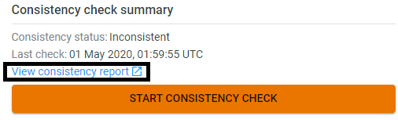

1. The Consistency Status will determine the next steps:

    - Consistent - no action needed

    - Inconsistent - migration required

   **Consistency check before migration**:
  
   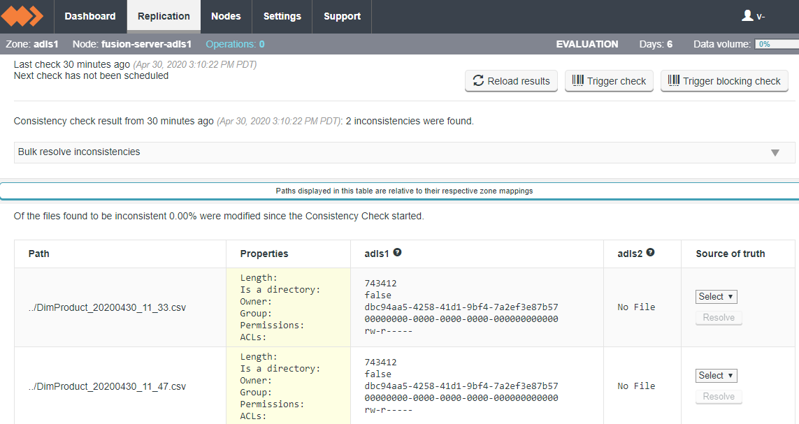

   To know more refer to [Consistency Check using WANdisco fusion](https://docs.wandisco.com/bigdata/wdfusion/2.12/#consistency-check)

   > Note: **START CONSISTENCY CHECK** is recommended for small set of data volume.

## Migration using LiveMigrator

Once HCFS replication rule is created, migration activity can be started using the LiveMigrator. This allows migration of data in a single pass while keeping up with all changes to the source storage(ADLS Gen1). As an outcome data consistency is gauranteed between source and target.

> Note: The Gen2 is synchronized with Gen1 source using consistency checks and scheduled migrations.

1. **Get Sample data**

    Upload sample data to the ADLS Gen1 storage account, see the [guide](https://docs.microsoft.com/azure/data-lake-store/data-lake-store-get-started-portal#uploaddata) to know more.

1. Place it within the home mount point.

1. On the Fusion UI dashboard, view the HCFS rule.

    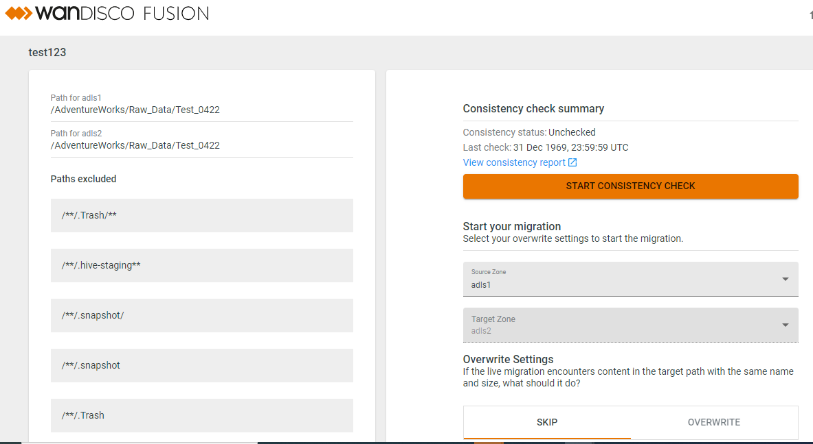

    The overwrite settings needs to be configured. This determines what happens if the LiveMigrator encounters content in the target path with the same name and size.

    - **Skip**: If the filesize is identical between the source and target, the file is skipped. If it’s a different size, the whole file is replaced.

    - **Overwrite**: Everything is replaced, even if the file size is identical.

1. Start your migration with the following settings:

    Source Zone = adls1

    Target Zone = adls2

    Overwrite Settings = Skip / Overwrite

1. Wait until the migration is complete, and check the contents in the ADLS Gen2 container.

    **Consistency check after migration**:

    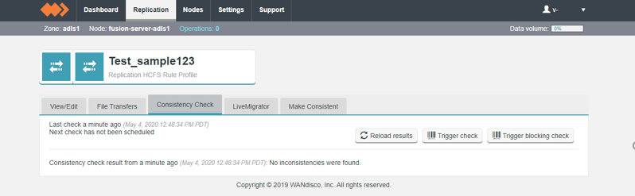

    > NOTE: A hidden folder :file_folder: .fusion will be present in the ADLS Gen2 path.

    > Limitation: Client based replication is not supported by Fusion UI , so replication process here is manually driven.

## Managing Replication

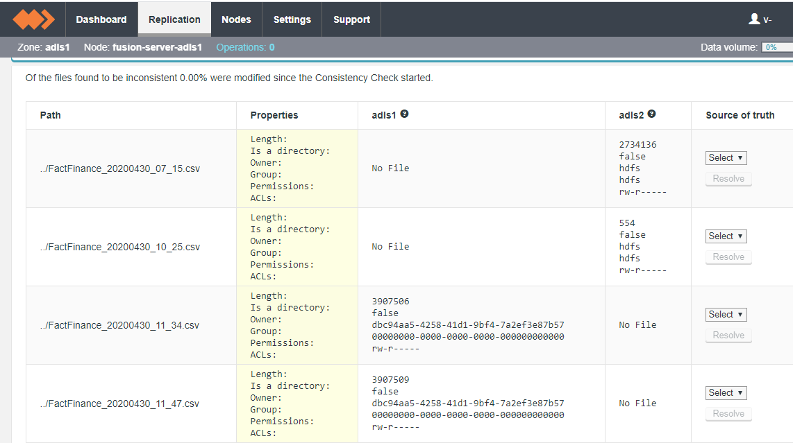

To know more visit [How to manage replication](https://docs.wandisco.com/bigdata/wdfusion/2.12/#managing-replication)

## Application Update
  
As part of this, we will [configure services in workloads](https://docs.microsoft.com/azure/storage/blobs/data-lake-storage-supported-azure-services) used and update the applications to point to Gen2 mount after the migration is complete.

We will be covering below azure services

- Azure Data Factory
  - [Load data into Azure Data Lake Storage Gen2 with Azure Data Factory](https://docs.microsoft.com/azure/data-factory/load-azure-data-lake-storage-gen2)
- Azure Databricks
  - [Use with Azure Databricks](https://docs.microsoft.com/azure/databricks/data/data-sources/azure/azure-datalake-gen2)
  - [Quickstart: Analyze data in Azure Data Lake Storage Gen2 by using Azure Databricks](https://docs.microsoft.com/azure/storage/blobs/data-lake-storage-quickstart-create-databricks-account)
  - [Tutorial: Extract, transform, and load data by using Azure Databricks](https://docs.microsoft.com/azure/azure-databricks/databricks-extract-load-sql-data-warehouse)
- SQL Data Warehouse
  - [Use with Azure SQL Data Warehouse](https://docs.microsoft.com/azure/data-factory/load-azure-sql-data-warehouse)

This can be achieved by following a phased approach where in the migration of data, work loads and applications will be validated incrementally.

### Mount path configuration

This will show how to set and configure the mount paths for Gen1 and Gen2 in the MountConfiguration script.

**Gen1 mount path configuration**:


**Gen2 mount path configuration**:

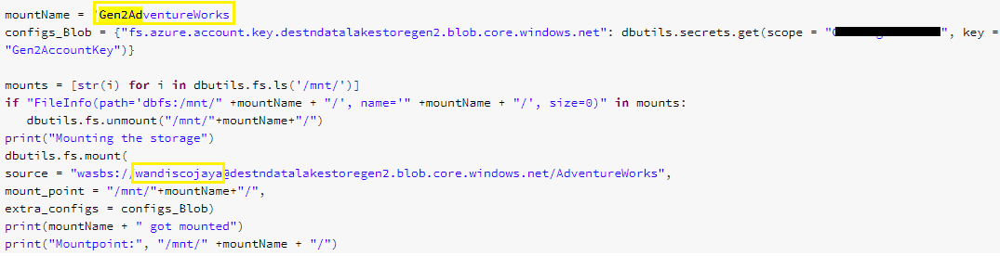

### Beginning State

**Before Migration**-- The data pipeline is on Gen1

In this state the data ingestion from ADB to Raw folder, writing the processed data into the Processed folder and loading the processed data to SQL DW will be happening at Gen1.

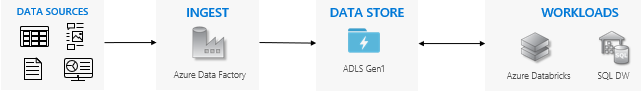

Sample design:

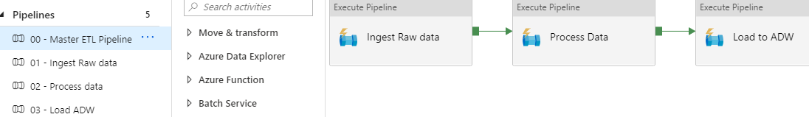

All the ADB notebooks will be pointing to Gen1 Mount path in this state and the data will be ingested, processed and loaded to SQL DW from Gen1.

### Interim State
  
In this state we will start with the migration of the existing Gen1 data to Gen2 using **Wandisco fusion**. The data pipeline will be set to Gen1 and Gen2 partially which will include the data ingestion and processing happening at Gen1 meanwhile writing the processed data to SQL DW at Gen2.
  
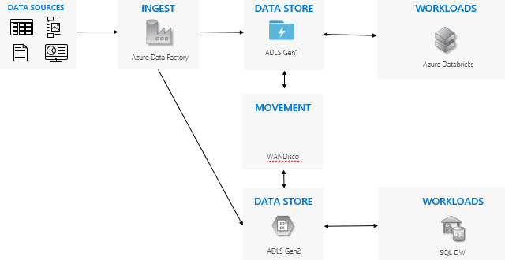

Follow the steps for the [migration](#migration-using-livemigrator) of Gen1 data to Gen2 for the Raw and Processed data.

Once the data is migrated, run **Consistency check** in Fusion UI. There should be no inconsistencies.

**How to change the mount path**

This will show how to configure the mount path for the work load Azure Databricks which will load processed data to SQL DW at Gen2.
In the master pipeline in Azure Datafactory, Go to the notebook **settings** --> **Base parameters** and mount the **RootPathParam** to Gen2.

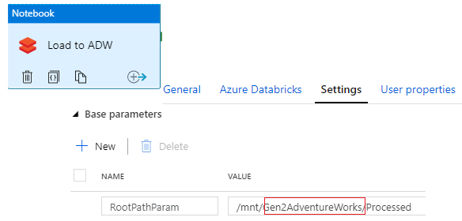

**Note**: At the end of this state we will acheive to establish data pipeline partially at Gen1 and Gen2.

### Eventual End State
  
**After Migration** -- The data pipeline moved to Gen2

This state depicts when all the work loads and applications are moved from Gen1 to Gen2 and the bi directional replication is ready to   be turned off.

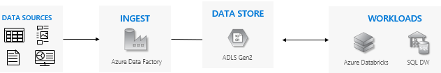

Below are the steps to change the mount path from Gen1 to Gen2 for the Azure Databricks notebook in Azure Datafactory pipeline


Run the master pipeline consisting of all the ADB notebooks and check the data. The ingestion and processing of raw data should take place at Gen2 now along with writing to SQL DW.
 This can be verified by checking the data at Gen2 storage. And when **Consistency check** is run using WAndisco Fusion UI , there will be files missing at Gen1.

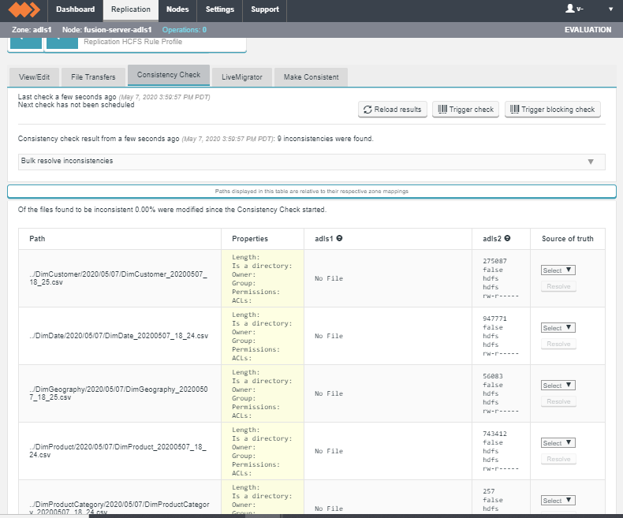

> Note: This marks the state where all the workloads are moved to Gen2. Gen1 will not revieve any new data in any form.

**Cutover from Gen1 to Gen2**
 After all the applications and workloads are stable on Gen2, Turn off any remaining pipelines that are running on Gen1 and decommission your Gen1 account. This will include deletion of the rules created for the migration and replication process. Shutting down the Azure VM and deleting the resource group.

## References

- [WANdisco fusion Installation and set up guide](https://wandisco.github.io/wandisco-documentation/docs/quickstarts/preparation/azure_vm_creation)
- [WANdisco LiveMigrator](https://www.wandisco.com/products/live-migrator)
