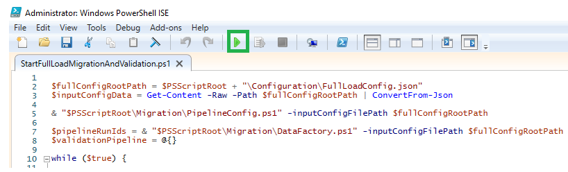
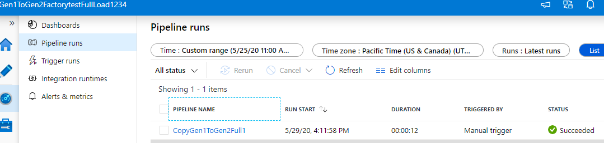
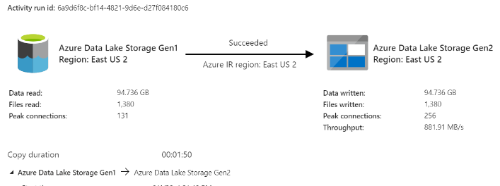
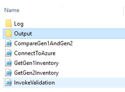
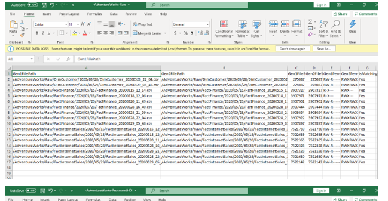

# Lift and Shift Copy Pattern Guide: A quick start template

## Overview

The purpose of this document is to provide a manual in form of step by step guide for the lift and shift copy pattern from Gen1 to Gen2 storage using Azure Data Factory and PowerShell. As such it provides the directions, references, sample code examples of the PowerShell functions been used.

This guide covers the following tasks:

- Set up kit for lift and shift copy pattern from Gen1 to Gen2
- Data Validation between Gen1 and Gen2 post migration
- Application update for the workloads

Considerations for using the lift and shift pattern

- Cutover from Gen1 to Gen2 for all workloads at the same time.
- Expect downtime during the migration and the cutover period.
- Ideal for pipelines that can afford downtime and all apps can be upgraded at one time.

## Prerequisites

- **Active Azure Subscription**

- **Azure Data Lake Storage Gen1**

- **Azure Data Lake Storage Gen2**. For more details please refer to [create azure storage account](https://docs.microsoft.com/azure/storage/common/storage-account-create?tabs=azure-portal)

- **Azure Key Vault**. Required keys and secrets to be configured here.

- **Service principal** with read, write and execute permission to the resource group, key vault, data lake store Gen1 and data lake store Gen2. To learn more, see [create service principal account](https://docs.microsoft.com/azure/active-directory/develop/howto-create-service-principal-portal) and to provide SPN access to Gen1 refer to [SPN access to Gen1](https://docs.microsoft.com/azure/data-lake-store/data-lake-store-service-to-service-authenticate-using-active-directory)

- **Windows PowerShell ISE**.

    **Note** : Run as administrator

    ```powershell
    //Run below code to enable running PS files
    Set-ExecutionPolicy Unrestricted

    //Check for the below modules in PowerShell . If not existing, install one by one:
    Install-Module Az.Accounts -AllowClobber -Force 
    Install-Module Az.DataFactory -AllowClobber -Force
    Install-Module Az.KeyVault -AllowClobber -Force    
    Install-Module Az.DataLakeStore -AllowClobber -Force
    Install-Module PowerShellGet –Repository PSGallery –Force

    //Close the PowerShell ISE and Reopen as administrator. Run the below module
    Install-Module az.storage -RequiredVersion 1.13.3-preview -Repository PSGallery -AllowClobber -AllowPrerelease -Force
    ```

## Limitations

This version of code will have below limitations:

- Gen1 & Gen2 should be in same subscription
- Supports only for single Gen1 source and Gen2 destination
- Code Developed and Supported only in Windows PowerShell ISE

## Migration Framework Setup

This section will help you with the steps needed to set up the framework and get started with the migration process.

### Get Started

**Download the migration source code located [here](./lift-and-shift.zip) to your local machine**:

> Note: To avoid security warning error --> Right click on the zip folder downloaded --> Go to --> Properties --> General --> Check unblock option under security section. Unzip and extract the folder.

The download will contain below listed contents:

- **Application**: This folder will have sample code for Mount path configuration.

- **Configuration**: This folder will have the configuration file `FullLoadConfig.json` and all the required details of resource group and subscription along with source and destination path of ADLS Gen1 and Gen2.

- **Migration**: Contains the templates to create dynamic data factory pipeline and copy the data from Gen1 to Gen2.

- **Validation**: Contains the PowerShell scripts which will read the Gen1 and Gen2 data and write the comparison report post migration.

- **StartFullLoadMigrationAndValidation.ps1**: Script to invoke the full load Migration and Validation process to compare the data between Gen1 and Gen2 post migration and generate summary report.
  
### How to Set up Configuration file

**Important Prerequisite**:

- Provide Service principal access to configure key vault as below:

    

- Make an entry of Gen2 Access key in the key vault as shown below :

    

    **Below is the code snapshot for setting the configuration file to connect to azure data factory**:

    ```powershell
    "gen1SourceRootPath" : "https://<<Enter the Gen1 source root path>>.azuredatalakestore.net/webhdfs/v1", 
    "gen2DestinationRootPath" : "https://<<Enter the Gen2 destination root path>>.dfs.core.windows.net", 
    "tenantId" : "<<Enter the tenantId>>", 
    "subscriptionId" : "<<Enter the subscriptionId>>", 
    "servicePrincipleId" : "<<Enter the servicePrincipleId>>", 
    "servicePrincipleSecret" : "<<Enter the servicePrincipleSecret Key>>", 
    "keyVaultName" : "<<Enter the keyVaultName>>",
    "factoryName" : "<<Enter the factoryName>>", 
    "resourceGroupName" : "<<Enter the resourceGroupName under which the azure data factory pipeline will be created>>",
    "location" : "<<Enter the location>>", 
    "overwrite" : "Enter the value" //  True = It will overwrite the existing data factory ,False = It will skip creating data factory
    ```

  **Setting up the factory pipeline for lift and shift copy pattern**

    ```powershell
    "pipelineId": "<<Enter the pipeline number. For example: 1,2"
    "fullLoad": "true"

    // Activity 1
    "sourcePath" : "Enter the Gen1 full path. For example: /path-name",
    "destinationPath" : "Enter the Gen2 full path. For example: path-name",
    "destinationContainer" : "Enter the Gen2 container name"

    // Activity 2
    "sourcePath" : "Enter the Gen1 full path. For example: /path-name",
    "destinationPath" : "Enter the Gen2 full path. For example: path-name",
    "destinationContainer" : "Enter the Gen2 container name"
    ```

> NOTE: The **destinationPath** string will not be having Gen2 container name. It will have the file path same as Gen1. See the `FullLoadConfig.json` script for more reference.

### Azure data factory pipeline creation and execution

Run the script `StartFullLoadMigrationAndValidation.ps1` which will trigger the migration and validation process. This step will create the data factory as per the configuration file.



### Azure Data factory pipeline monitoring

The pipeline is created in Azure data factory and can be monitored in below way:



## Data Validation

The `StartFullLoadMigrationAndValidation.ps1` script triggers the data validation process between Gen1 and Gen2 once the **migration is completed** in above step.  

To monitor the execution details for each copy activity, select the Details link (eyeglasses image) under Actions in the activity monitoring view. You can monitor details like the volume of data copied from the source to the sink, data throughput, execution steps with corresponding duration, and used configurations.
  


**Verify that the data is copied into your Azure Data Lake Storage Gen2 account**.

### Data Comparison Report

Once the Gen1 and Gen2 data is compared and validated, the result is generated in CSV file into the **Output** folder as below:



The CSV file will show the matched and unmatched records with file path, file size, Permission for Gen1 and Gen2 records and Ismatching status.



> Note: IsMatching status = Yes (For matched records) and No (For Unmatched records)

## Application update

This step will configure the path in the workloads to Gen2 endpoint.

Refer to [Application and Workload Update](../application-update) on how to plan and migrate workloads and applications to Gen2.

## References

- [Migrate Azure Data Lake Storage from Gen1 to Gen2](https://docs.microsoft.com/azure/storage/blobs/data-lake-storage-migrate-gen1-to-gen2)
