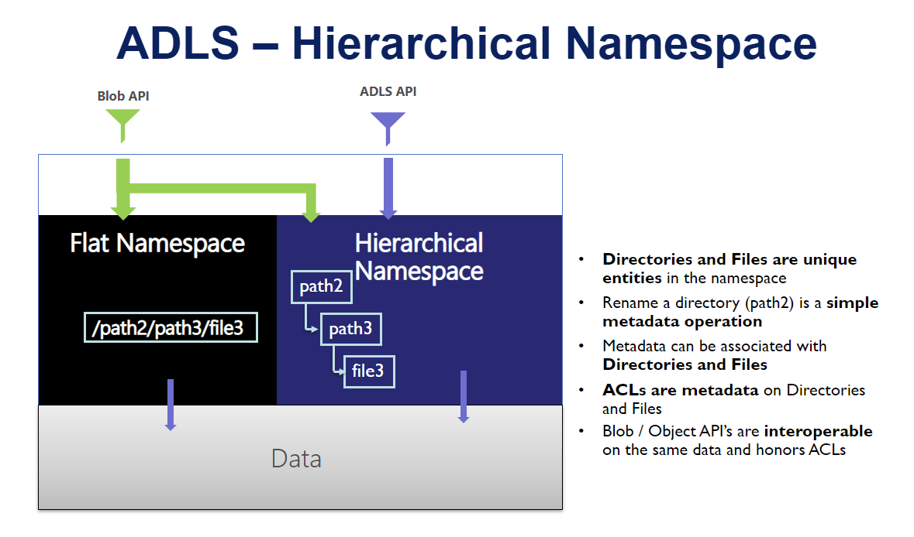
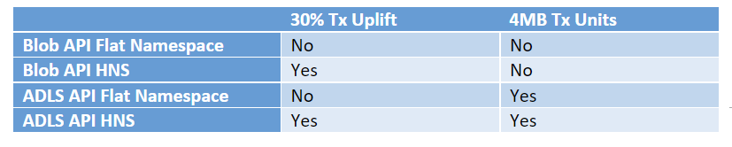

# Azure Data Lake Storage Gen2 Billing FAQs

> The pricing page for ADLS Gen2 can be found [here](https://azure.microsoft.com/pricing/details/storage/data-lake). This resource provides more detailed answers to frequently asked questions from ADLS Gen2 users.

## Terminology
Here are some terms that are key to understanding ADLS Gen2 billing concepts. 

**Flat namespace (FNS)**: A mode of organization in a storage account on Azure where objects are organized using a flat structure - aka a flat list of objects. This is the default configuration for a storage account. 

**Hierarchical namespace (HNS)**:  With hierarchical namespaces, you can organize data into structured folders and directories.  A hierarchical namespace allows operations like folder renames and deletes to be performed in a single atomic operation, which with a flat namespace requires a number of operations proportionate to the number of objects in the structure. Hierarchical namespaces store additional meta-data for your directory and folder structure, and allows Filesystem ACLs. However, as your data volume grows, hierarchical namespaces keeps your data organized and more importantly yields better storage performance on your analytic jobs – thus lowering your overall TCO to run analytic jobs. 

**HNS enabled account**: A Storage Account with the Hierarchical Namespace enabled. 

**Query Acceleration**: Query acceleration enables applications and analytics frameworks to dramatically optimize data processing by retrieving only the data that they require to perform a given operation. This reduces the time and processing power that is required to gain critical insights into stored data. 

**Data**: Data is the content and is the stored information. Example: Files in a folder.

**Metadata**: Meta Data is the context for the data and consists of one or more name-value pairs that you specify for a Blob storage resource. You can use metadata to store additional values with the resource. Metadata values are for your own purposes only, and don't affect how the resource behaves. Metadata also includes the size used by Path / Name of the object. 

## FAQs

### How do calls to certain API's translate into the number of 4MB transactions that will be billed?

* When uploading or appending data to existing files, or when reading data from a file, the operation gets chunked into 4MB pieces. You will then be billed for each 4MB chunk.   
* The Copy File, Rename, Set Properties, etc. would not be charged using the “per 4 MB” rule. They are not free operations but would be charged as a single transaction. 
* For files < 4MB, a full transaction will be charged for each file. It is recommended to write larger files as they will yield better analytics performance and are more cost effective.   

### How can I figure out the metadata size for my account?

* The metadata size is calculated for every file by the following: 512 bytes + size of file name + size of file properties    
   
### What APIs are considered Iterative read operations? 

* Iterative read operations are operations performed on a folder that requires the system to iterate through all the subfolders and files in that folder to complete. Examples: ListFileSystem, ListFileSystemDir,ListPath and all List* operations 

### If I were to store parquet files into ADLS, would that be a write transaction based on size or just a storage cost? 

* Write transactions apply whenever you ingest or update any type of file. However, you do pay for the data at rest. 

### What is the difference between how transactions are billed in a flat namespace account (FNS) and a Hierarchical Namespace account? 

* Customers can access the storage account using either an FNS account or a HNS account. The API's can also be regular API's or ADLS API's. The following table shows you when data operations get split into 4MB chunks for billing and when the 30% uplift is applied.  
   
* Renames/moves as part of analytics job commit activities will end up with a lot of operations (proportional to object count) with FNS while this would be a single transaction in HNS. 
   
### How are iterative operations billed? 

* An example would be a rename of a folder containing 10K files. The rename would be charged as a single metadata operation (iterative writes). 

## Recommended reading
- [Overview for Azure Data Lake Storage Gen2](https://docs.microsoft.com/azure/storage/blobs/data-lake-storage-introduction)

