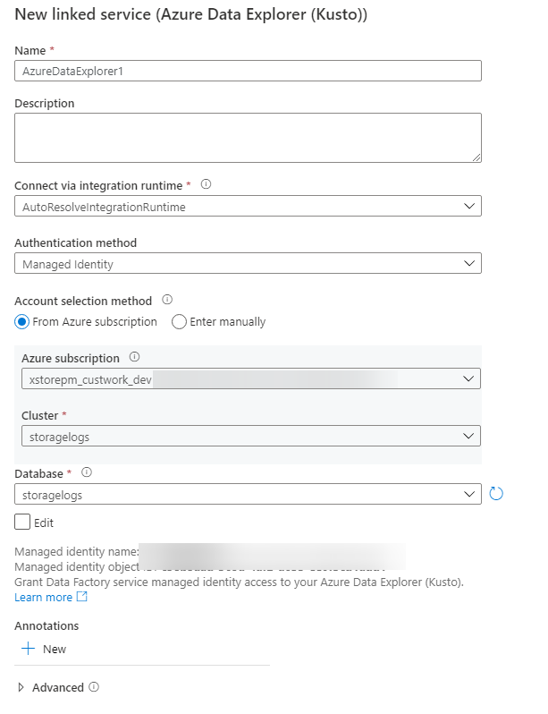

# Load, Parse and Summarize Classic Azure Storage Logs in Azure Data Explorer

Azure Storage is moving to use Azure Monitor for logging. This is great because querying logs with Kusto is super easy. [More info](https://docs.microsoft.com/azure/storage/blobs/monitor-blob-storage)

> **If you can use Azure Monitor, use it, and don’t read the rest of this article.**

However, some customers might need to use the Classic Storage logging, but our classic logging goes to text files stored in the `$logs` container in your storage account. [More info](https://docs.microsoft.com/azure/storage/common/storage-analytics-logging)

What if you wanted the convince of Kusto queries but had a requirement to use the classic storage logging.

You can achieve this using Data Explorer. This is the same datastore technology that Azure Monitor uses. Additionally you can automate the ingestion of the text logs into Data Explorer with Data Factory.

Read about both those technologies here:
[Data Factory (ADF)](https://docs.microsoft.com/azure/data-factory/introduction)
[Data Explorer (ADX)](https://docs.microsoft.com/azure/data-explorer/data-explorer-overview)

## Step by Step

1. Create your storage account (if not already done) [More Info](https://docs.microsoft.com/azure/storage/common/storage-account-create)

1. Enable Storage logs (if not already done) [More Info](https://docs.microsoft.com/azure/storage/common/manage-storage-analytics-logs)

1. Create a Data Explorer Cluster & Database [More Info](https://docs.microsoft.com/azure/data-explorer/create-cluster-database-portal)

1. You can now create a table to store the logs, this is the script that I used.

    ``` text
    .create table storagelogs (
        VersionNumber: string, 
        RequestStartTime: datetime, 
        OperationType: string, 
        RequestStatus: string, 
        HttpStatusCode: string, 
        EndToEndLatencyInMS: long, 
        ServerLatencyInMs: long, 
        AuthenticationType: string, 
        RequesterAcountName: string, 
        OwnerAccountName: string, 
        ServiceType: string, 
        RequestUrl: string, 
        RequestedObjectKey: string, 
        RequestIdHeader: guid, 
        OperationCount: int, 
        RequesterIpAddress: string, 
        RequestVersionHeader: string, 
        RequestHeaderSize: long, 
        RequestPacketSize: long, 
        ResponseHeaderSize: long, 
        ResponsePacketSize: long, 
        RequestContentLength: long, 
        RequestMd5: string, 
        ServerMd5: string, 
        EtagIdentifier: string, 
        LastModifiedTime: datetime, 
        ConditionsUsed: string, 
        UserAgentHeader: string, 
        ReferrerHeader: string, 
        LogSource: string)
    ```

    See log format details [here](https://docs.microsoft.com/rest/api/storageservices/storage-analytics-log-format)

    

1. Create the Azure Data Factory [here](https://docs.microsoft.com/azure/data-factory/quickstart-create-data-factory-portal#create-a-data-factory) (just this section, not the entire lab)

    The last step should be to launch the "Author & Monitor" tool

    

1. When the tool is launched select "Copy Data"

    

1. Give your task a name/description, select Tumbling Window, and set the recurrence to the period you want. Press Next.

    > Shorter windows will reduce delay between when something is logged and when it appears in Data Explorer, however it will increase your Data Factory costs.

    

1. Select create a new connection and "Azure Blob Storage" as the linked service. Populate the configuration for the linked service. Select the options that are appropriate for your environment, test the connection, then create the linked service. And press next to select the source dataset.

    

    I am using a managed identity here, I have given this managed identity "Storage Blob Data Reader" permissions on the storage account.

    

1. Choose the input file or folder, type in `$logs/` in the file or folder box. NOTE: you cannot use the browse feature. Select `Incremental Load: LastModifiedDate`, and press next

    

1. This should now go and pull some data from the container for you to tell ADF how to parse the log files. Here I leave the defaults, but ADD an additional column to record what log file the record came from. Press Next.

    

1. Pick your destination, select "create new connection", select Azure Data Explorer, populate the configuration for the linked service. Select the options that are appropriate for your environment, test the connection, then create the linked service. And press next to select the destination dataset.

    

    I am using a managed identity here, I have given this managed identity "Admin" permissions on the database (NOT the Data Explorer server) You need admin to do the mapping in the next step.

    

1. You should now be prompted to select a table in data explorer to load the data into., do so then select next.

    

1. You should now see that ADF has mapped over our source to destination columns 1 by 1 for us, all these defaults should be good, press next.

    

1. Adjust the settings per your needs, I am just going to leave the defaults and press next.

    

1. Review the summary and press next, it should validate, and set everything up for you, now your ADF job is all setup. When new logs arrive, they will be parsed and inserted into ADX.

1. You should now be able to query your ADX database to review the logs.

    
